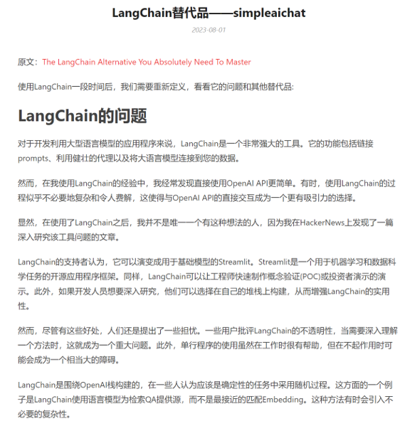

<div id="top"></div>
<div align="center">
  <h1>Jian-agent</h1>

[English](README.md) | 简体中文

</div>

## 简介

Jian-agent象征着“简”，是极简Agent开发框架。

Jian Agent 是一个开源的多功能工具集 及 API 库，用于扩展和增强基于大型语言模型（LLM）的智能体（Agent）。

类似于Langchain、Simpleaichat、AgentLego等。但是主打写法简洁，抛弃令人诟病的Langchain的臃肿。

如下图所述：



具有以下突出特点：

+ 它写法超级简单，相比Lang-chain，后者功能虽然强大，但设计得太臃肿了，Jian（简）有着完全不一样的设计理念，它提倡帮助开发者，而不是牵着开发者鼻子走。

+ 它基于模块化设计和依赖简单，可以和其他框架相互集成，因此可以和Langchain、llamaIndex等一起使用。

它是“风后®AI”服务开发所用的基础框架，具备企业级产品支撑能力。

Jian-agent 可用于构建轻量级基于大语言模型的智能体（agent）框架，支持用户快速地将一个大语言模型转变为多种类型的智能体，并提供了一些典型工具为大语言模型赋能。

它的框架简单示意图如下:


## 特性

- 与基于LLM的代理程序框架轻松集成，如Jian-agent、FastChat、Langchain。
- 接口统一，设计全面升级，提升拓展性，包括
  - Model : 支持各种模型，兼容OpenAI API, 亦有自己的一套OpenAPI规范，用法十分的简洁；
  - Action: 简单的继承和装饰，即可打造自己个人的工具集，不论 私有LLM 还是 GPT 均可适配；
  - Agent：与 Model 的输入接口保持一致，模型到智能体的蜕变只需一步，便捷各种 agent 的探索实现；
- 提供RAG等全面支持，涵盖RAG领域基本功能和各种优化，例如混合检索、重排序等；
- 丰富的内置工具集，包括大语言模型、图像生成、语音处理和视觉语言推理等。
- 灵活的工具接口，允许用户轻松扩展具有任意类型参数和输出的自定义工具；
- 它也可以和其他框架协作和相互集成，可以在保留Langchain等情况下，优先选择Jian-agent作为主力，Langchain、llamaIndex等作为辅助；
- 文档全面升级，API 文档全覆盖。

### 安装

通过 pip 进行安装 (推荐)。

```bash
pip install Jian-agent
```

### 运行一个智能体的网页样例

你可能需要先安装 Streamlit 包

```bash
# pip install streamlit
streamlit run examples/streamlit_agent_web_demo.py
```


## 引用

如果你觉得本项目对你的研究工作有所帮助，请参考如下 bibtex 引用 Jian-agent：

```latex
@misc{Jian-agent 2023,
    title={{Jian-agent} a lightweight open-source framework that allows users to efficiently build large language model(LLM)-based agents},
    author={Jian-agent Developer Team},
    howpublished = {\url{https://github.com/zollty/Jian-agent}},
    year={2023}
}
```

## 开源许可证

该项目采用[Apache 2.0 开源许可证](LICENSE)。

<p align="right"><a href="#top">🔼 Back to top</a></p>
